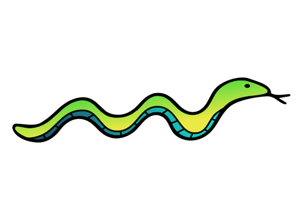
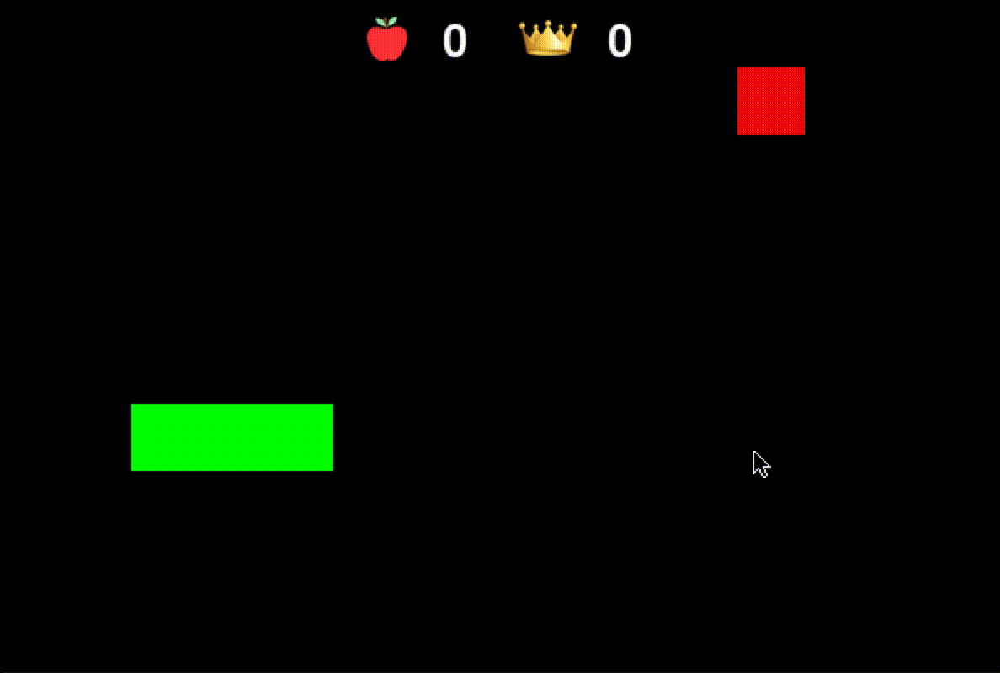

# Snake

<p align = "center">


A work in progress game of [snake](https://en.wikipedia.org/wiki/Snake_(video_game_genre)) made using pygame; comes with a simple AI version to run and another version you can play manually. 

## Installation

Requirements: Python 3.X+

```
git clone https://github.com/evanfitzgerald/snake.git

pip3 install -r requirements.txt

python3 snake.py
```

Additionally, to run the AI version: 
```
python3 AI.py
```

## Usage

As of the most recent commit both versions are fully playable. The AI version is currently still very basic, the snake is able to get to the food by avoiding itself and some the bad pathways it is faced with. At its current state the AI operates similarly to as in the demo below.

<p align = "center">

  
 ### Other Features
 To visualize the snake's bad pathways set the __visualize__ variable to True in AI.py. The yellow spots that appear will represent where the snake should avoid.
 ```
 visualize = True
 ```
 
## Liscense

See the [LICENSE](https://github.com/evanfitzgerald/snake/blob/master/LICENSE) file for license rights and limitations.
