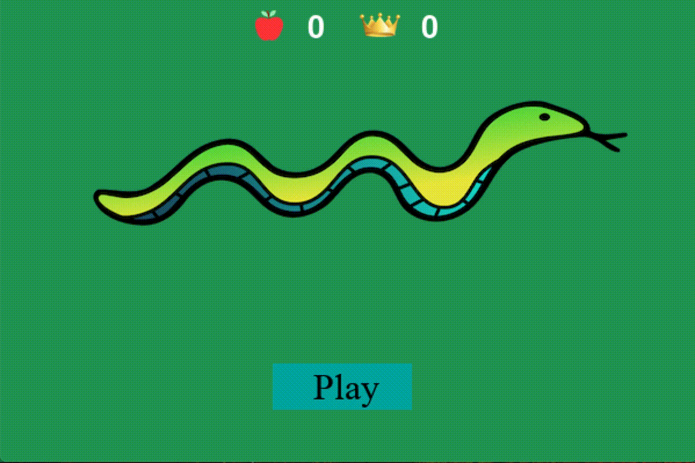

# Snake

<p align = "center">


A game of [snake](https://en.wikipedia.org/wiki/Snake_(video_game_genre)) made using pygame; comes with a rule based AI version to run and another version you can play manually. 

## Installation

Requirements: Python 3.X+

```
git clone https://github.com/evanfitzgerald/snake.git

pip3 install -r requirements.txt

python3 snake.py
```

Additionally, to run the rule based AI version: 
```
python3 rule-based-AI.py
```

## Usage
In the manual version you can control the snake by either using the arrow keys or WASD, you can also pause/start the game by clicking on the space bar (this also applies to the AI version). 

The rule based AI operates similarly to as in the demo below.

<p align = "center">

  

  
 ### Other Features
 To visualize the snake's bad pathways set the __visualize__ variable to True in rule-based-AI.py. The yellow spots that appear will represent where the snake should avoid, note the visualized example below.
 ```
 visualize = True
 ```
<p align = "center">

 
## Liscense

See the [LICENSE](https://github.com/evanfitzgerald/snake/blob/master/LICENSE) file for license rights and limitations.
